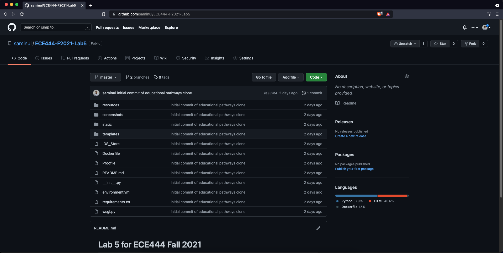
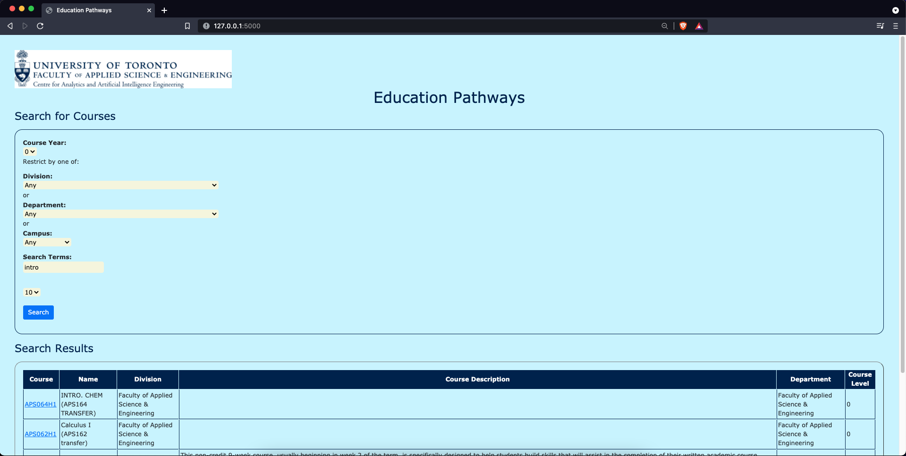

# Lab 5 for ECE444 Fall 2021

By: Saminul Islam

This   repo   is   a   clone   of https://github.com/nelaturuk/education_pathways.

## Activity 1

## Activity 2-5

### Home Page

### Results Page - Form

### Results Page - Table

## Activity 6

In the new styled UI, the results table has been formatted to be more readable. The table header has been formatted by adding a backgroud color, changing text color and center aligning it making it easier to disginguish. Borders were also added for the table making it easier to read the information.
